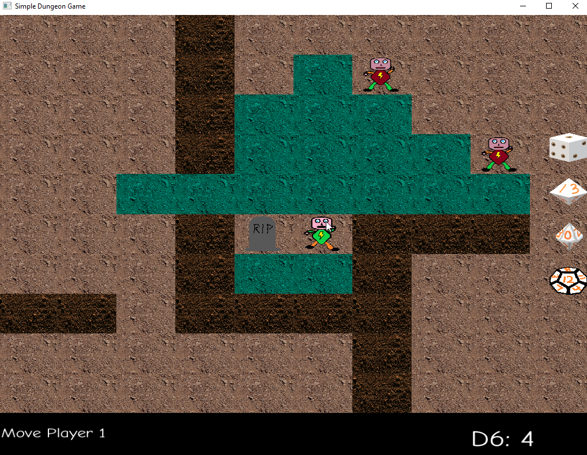
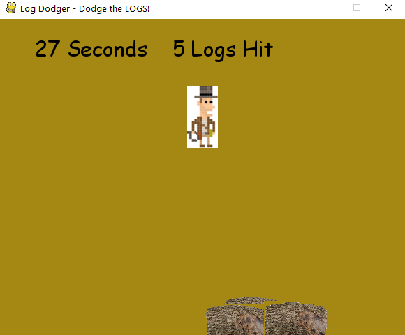

# Game Programmer Portfolio

### _Home_ | [Resume][]

__Contact:__

*  _<contact@chrisbarill.com>_

*  _[304.376.0150](tel:+13043760150)_

*  _Resume: [Word](ChrisBarillResume.docx) / [PDF](ChrisBarillResume.pdf) / [HTML](resume)_

[Home]: index "View My Projects"
[Resume]: resume "View My Resume"
[About Me]: about "Read About Me"

 

Hello! My name is Chris Barill, and I am a Software Engineer and Game Developer. I hold a Bachelor of Science degree in Computer Science from West Virginia University and have a decade of experience in software engineering, with the past two years in the Games industry. I previously worked on the Bridges team at Epic Systems and multiple implementations of Gentax at FAST Enterprises. I currently lead the Live Ops Tech team for MyFaction mode in WWE 2K23 and WWE 2K24 at Lost Boys Interactive, in collaboration with Visual Concepts and 2K Games.

 

## Credited Professional Projects

### WWE 2K24 MyFaction - Ranked Matchmaking
Python, Flask, MySQL, Redis     
[Official Site](https://wwe.2k.com/2k24/myfaction/)     
I worked on the server API and database schema design for the new Ranked Matchmaking mode. I wrote the majority of Seasons and Ranking processing in Python, including calculation of Ranking Point changes, Season Rollover, and distribution of rewards based on final ranking. I also implemented Leaderboards using Sorted Sets in Redis, including mechanisms for recovery in the event of Redis failure and tooling for QA to manipulate ranks and ranking points for thorough testing of all aspects of Ranked Matchmaking.

After completing work on the Ranked Matchmaking feature, I transitioned to the Live Operations team to perform Load Testing on the server. I optimized both Python code and SQL queries (mostly via the SQLAlchemy ORM, but sometimes raw SQL) and found a memory leak in a third-party Python library. The Load Testing work included updating Locust scripts to account for changes between 2K23 and 2K24 and similar changes to a database fill tool used for approximating data for up to six months post-launch.

After launch, I became Lead of the Live Ops Tech team, continuing to support the live games.

### WWE 2K23 MyFaction - Live Events
Python, Flask, MySQL, Redis     
[Official Site](https://wwe.2k.com/2k23/myfaction/)     
I joined the team near the end of feature development, but contributed by adding Live Events caching to an existing cache system built on Redis. I then transitioned to the Live Operations team to perform Load Testing. I ran Load Tests, documented the results and analyzed them for endpoints needing improved, then did deeper performance testing on the problem code and made improvements in both Python and SQL queries.

In the first 30 days post-launch, I investigated a handful of Production incidents, finding and fixing the root causes, and then ushering the fixes through testing and deployment to get them into the live game within 24 hours.

## Personal Projects

### Digital Tabletop RPG, For Kids 
C++, SFML   
[View on GitHub](https://github.com/cbarill2/SimpleDungeonGame)     
My current project is a tile-based, turn-based RPG with simple mechanics to introduce kids to tabletop gaming. It will feature a procedurally generated game board with monsters to defeat, prisoners to rescue, and treasure to collect.

### Pong Clone
C++, Direct2D      
[View on GitHub](https://github.com/cbarill2/Direct2DPong)  
Re-creation of _Pong_ with a bouncing ball and 2 opposing paddles, which can be moved independently using one keyboard (W and S to move the left paddle and the Up and Down arrow keys to move the right paddle).

### 3D Project
Java, LWJGL     
[View on GitHub](https://github.com/bourdain-industries/LearningLWJGL)      
Basic 3D space with a first-person camera. There is also some code for procedural generation of a simple 2D action-adventure dungeon (from before I switched it to 3D).

<iframe width="560" height="315" src="https://www.youtube.com/embed/V2FqSVKOMcY" frameborder="0" allow="accelerometer; autoplay; encrypted-media; gyroscope; picture-in-picture" allowfullscreen></iframe>

### Log Dodger
Python, PyGame      
My first game project: a simple arcade game, built for Intro to Game Design in college. You play as a treasure hunter trying to climb a hill while monkeys roll logs down the hill to impede you. Dodge the logs by moving left or right, but you never progress up the hill.

[Back to Top](#game-programmer-portfolio)