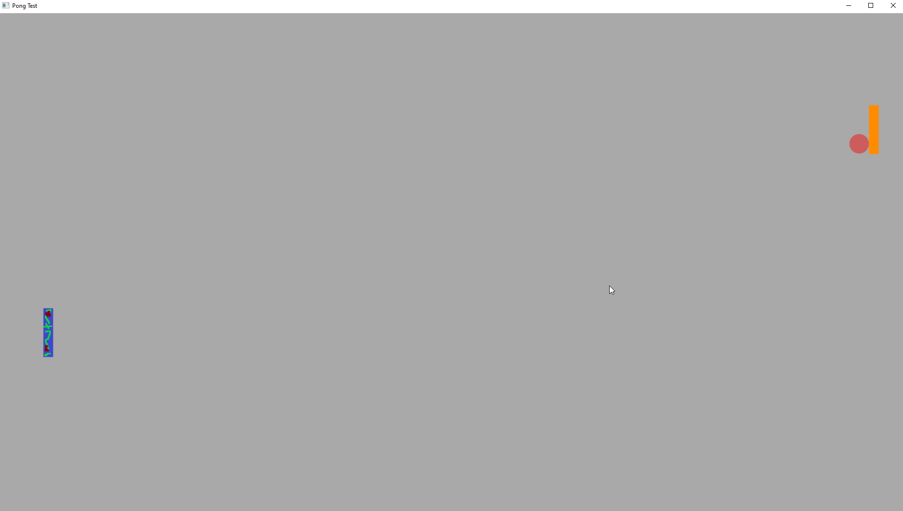

# Game Programmer Portfolio

### _Home_ | [Resume][]

__Contact:__

*  _<contact@chrisbarill.com>_

*  _[304.376.0150](tel:+13043760150)_

*  _Resume: [Word](ChrisBarillResume.docx) / [PDF](ChrisBarillResume.pdf) / [HTML](resume)_

[Home]: index "View My Projects"
[Resume]: resume "View My Resume"
[About Me]: about "Read About Me"

 

Hello! My name is Chris Barill, and I am a Software Engineer aspiring to be a Gameplay Engineer. I hold a Bachelor of Science degree in Computer Science from West Virginia University.

 

## Game Projects

### Digital Tabletop RPG, For Kids (C++, SFML)
[View on GitHub](https://github.com/cbarill2/SimpleDungeonGame)

My current project is a tile-based, turn-based RPG with simple mechanics to introduce kids to tabletop gaming. It will feature a procedurally generated game board with monsters to defeat, prisoners to rescue, and treasure to collect.

<vr>

### Pong Clone (C++, Direct2D)

[View on GitHub](https://github.com/cbarill2/Direct2DPong)

Re-creation of _Pong_ with a bouncing ball and 2 opposing paddles, which can be moved independently using one keyboard (W and S to move the left paddle and the Up and Down arrow keys to move the right paddle).

### 3D Project (Java, LWJGL)

[View on GitHub](https://github.com/bourdain-industries/LearningLWJGL)

Basic 3D space with a first-person camera. There is also some code for procedural generation of a simple 2D action-adventure dungeon (from before I switched it to 3D).

<iframe width="560" height="315" src="https://www.youtube.com/embed/V2FqSVKOMcY" frameborder="0" allow="accelerometer; autoplay; encrypted-media; gyroscope; picture-in-picture" allowfullscreen></iframe>

### Log Dodger (Python, PyGame)

My first game project: a simple arcade game, built for Intro to Game Design in college. You play as a treasure hunter trying to climb a hill while monkeys roll logs down the hill to impede you. Dodge the logs by moving left or right, but you never progress up the hill.

[Back to Top](#game-programmer-portfolio)