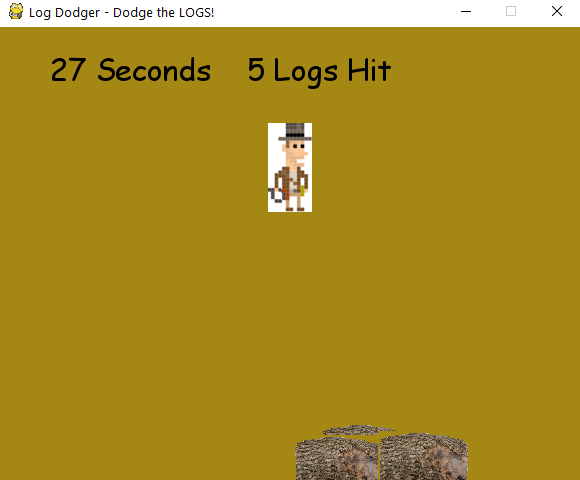

## Game Programmer Portfolio

### _Personal Projects_ | [Resume][] | [About Me][]

__Contact:__

*  _<contact@chrisbarill.com>_

*  _[304.376.0150](tel:+13043760150)_

[About Me]: about "Read About Me"
[Personal Projects]: projects "View My Projects"
[Resume]: resume "View My Resume"

<!--/>### Digital Tabletop RPG For Kids (C++, SFML)

A tile-based, turn-based RPG with simple mechanics to digitize tabletop gaming for kids. It features a procedurally generated game board with monsters to defeat, prisoners to rescue, and treasure to collect.
</!-->
### Pong Clone (C++, Direct2D) <a class="buttons github" href="https://github.com/cbarill2/Direct2DPong">View on Github</a>

Re-creation of the game _Pong_ with a bouncing ball and 2 opposing paddles, which can be moved independently using one keyboard (W and S to move the left paddle and the up and down arrow keys to move the right paddle).
<!--/>

</!-->
### 3D Project (Java, LWJGL) <a class="buttons github" href="https://github.com/crippledrat/LearningLWJGL">View on Github</a>

Basic 3D space with a first-person camera. There is also some code for procedural generation of a simple action-adventure dungeon (from before I switched it to 3D), but I never completed rendering for it. Though incomplete, this shows my understanding of object-oriented programming and project structure.
<!--/>

</!-->
### Log Dodger (Python, PyGame) <a class="buttons github" href="https://github.com/cbarill2/CodeSamples/blob/master/logdodger.py">View on Github</a>

My first game project: a simple arcade game, built for a Game Design class in college. You play as a treasure hunter trying to climb a hill while monkeys roll logs down the hill to impede you. Dodge the logs by moving left or right, but you never progress up the hill.

<a href="images/logdodger_gameplay.png">
</img>
</a>