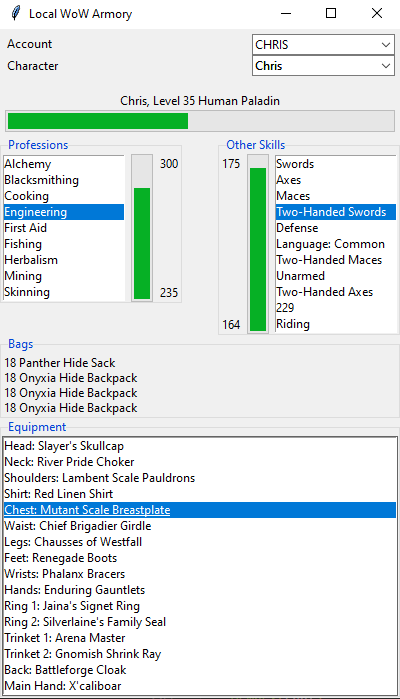

# Game Programmer Portfolio

### [Home][] | [Resume][]

__Contact:__

*  _<contact@chrisbarill.com>_

*  _[304.376.0150](tel:+13043760150)_

*  _Resume: [Word](ChrisBarillResume.docx) / [PDF](ChrisBarillResume.pdf) / [HTML](resume)_

[Home]: index "View My Projects"
[Resume]: resume "View My Resume"
[About Me]: about "Read About Me"

 

## World of Warcraft Character Info Viewer

### A tool for browsing characters on my local [MaNGOS Zero](https://getmangos.eu) server.

Written in Python using [tkinter](https://docs.python.org/3/library/tkinter.html) and [mysql.connector](https://dev.mysql.com/doc/connector-python/en/), it retrieves data from the server's MySQL database and displays it using a number of interactive widgets. I built it to easily view the different accounts on the server, the characters on those accounts, and the following information about those characters: Level, Race, Class, Professions, Bags, and currently equipped Items.

 

 

I may expand it in the future to add Quests, Mail, and more detail on the selected Item, but I tend to set it aside while not playing on the server.

[Back to Top](#game-programmer-portfolio)